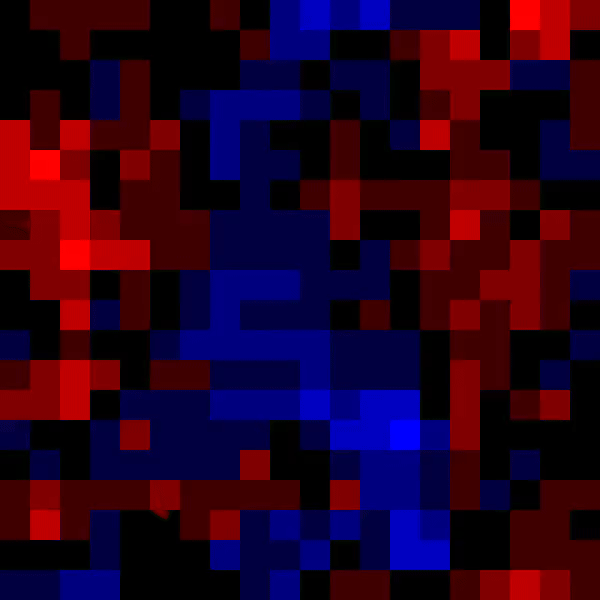

```sh
mkdir -p train/circle/bin
mkdir -p train/circle/ppm
mkdir -p train/rect/bin
mkdir -p train/rect/ppm
mkdir -p val/circle/bin
mkdir -p val/circle/ppm
mkdir -p val/rect/bin
mkdir -p val/rect/ppm
mkdir weights demo
```
